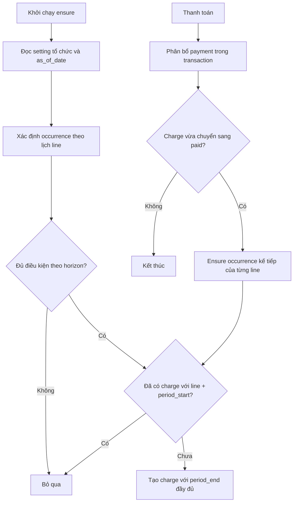
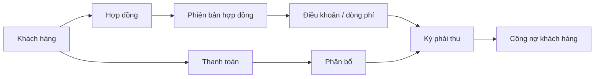

# Module Hợp đồng và Công nợ khách hàng — Thiết kế

## Trạng thái

- **Đã chốt hướng kiến trúc:** hợp đồng, phiên bản, khoản phí, kỳ phải thu, thanh toán và phân bổ thanh toán là các thực thể tách biệt.
- **Đã chốt hướng dòng tiền:** `direction` thuộc về từng khoản phí trong phiên bản hợp đồng, không thuộc toàn bộ hợp đồng.
- **Phạm vi hiện tại:** triển khai luồng thu tiền khách hàng (`receivable`). Các khoản phí mới được lưu mặc định là `receivable`; UI chưa hiển thị bộ chọn thu/chi cho đến khi có nghiệp vụ chi.
- **Đã chốt chính sách sinh kỳ:** hệ thống sinh kỳ trong cửa sổ `chargeGenerationLeadDays` của tổ chức hoặc ngay sau khi kỳ trước được thanh toán đủ; mặc định `chargeGenerationLeadDays = 0`.
- **RLS:** môi trường Supabase demo chưa setup RLS; migration chạy trực tiếp bằng database connection trong `.env` theo quy định của project.

## 1. Bối cảnh và mục tiêu

Một khách hàng có thể có nhiều hợp đồng. Mỗi hợp đồng có thể thay đổi chính sách nhiều lần trong vòng đời, có chu kỳ tính phí theo tháng/quý/năm và phát sinh nhiều khoản phải thu.

Tuy nhiên, thao tác hằng ngày của user không xoay quanh từng hợp đồng riêng lẻ. User quan tâm trước hết đến:

- Khách hàng đang còn nợ bao nhiêu.
- Khoản nào đã quá hạn.
- Khách hàng vừa trả bao nhiêu.
- Khoản tiền đó đã được phân bổ vào hợp đồng/kỳ nào.

Mục tiêu của module:

1. Quản lý vòng đời hợp đồng và lịch sử thay đổi chính sách.
2. Tự sinh các khoản phải thu theo chu kỳ.
3. Cho phép nhập một lần số tiền khách hàng thanh toán và tự phân bổ xuống nhiều hợp đồng/kỳ.
4. Hỗ trợ thanh toán một phần, thanh toán gộp nhiều kỳ và tiền trả thừa.
5. Hiển thị công nợ theo khách hàng là góc nhìn chính, đồng thời vẫn truy ngược được đến hợp đồng và kỳ phát sinh.
6. Đảm bảo lịch sử tài chính có thể audit, không bị thay đổi ngầm khi hợp đồng được chỉnh sửa.

## 2. Benchmark và nguyên tắc rút ra

### Salesforce

Salesforce cho phép kích hoạt hợp đồng, sau đó hợp đồng đã kích hoạt trở thành read-only; lịch sử hợp đồng và nhắc gia hạn được quản lý riêng. Điều này phù hợp với nguyên tắc: version đã hiệu lực không được sửa trực tiếp.

Tham khảo: [Manage Your Contracts](https://help.salesforce.com/s/articleView?id=sales.contract_manage_your_contracts.htm&language=en_US&type=5).

### Microsoft Dynamics 365 Finance

Dynamics tách billing schedule khỏi hợp đồng, hỗ trợ tần suất, số kỳ, tự gia hạn, prorate, ngày căn chỉnh và theo dõi thay đổi giá/tần suất. Đây là cơ sở để không gom “chu kỳ tính phí”, “hạn thanh toán” và “gia hạn hợp đồng” vào một trường.

Tham khảo: [Create billing schedules](https://learn.microsoft.com/en-us/dynamics365/finance/accounts-receivable/sb-billing-schedules) và [Recurring contract billing parameters](https://learn.microsoft.com/en-us/dynamics365/finance/accounts-receivable/sb-recur-bill-parameters).

### Odoo Subscriptions

Odoo sử dụng recurring plan/recurrence period để sinh phí định kỳ và xử lý gia hạn thủ công hoặc tự động. Khoản phải thu được sinh theo từng kỳ thay vì chỉ lưu một tổng tiền trên subscription.

Tham khảo: [Odoo Subscriptions](https://www.odoo.com/documentation/16.0/applications/sales/subscriptions.html) và [Scheduled actions](https://www.odoo.com/documentation/saas-18.4/applications/sales/subscriptions/scheduled_actions.html).

### Stripe và Dynamics — thanh toán một phần

Stripe và Dynamics đều giữ hóa đơn/khoản phải thu ở trạng thái còn số dư khi khách chỉ thanh toán một phần. Trường hợp trả thừa cần được ghi nhận thành credit/unapplied balance thay vì âm tiền hoặc tự làm thay đổi giá trị gốc.

Tham khảo: [Stripe partial payments](https://docs.stripe.com/invoicing/partial-payments) và [Dynamics customer payments for a partial amount](https://learn.microsoft.com/en-us/dynamics365/finance/accounts-receivable/customer-payments-partial-amount).

## 3. Quyết định kiến trúc đã chốt

### 3.1. Tách ba khái niệm thời gian

Không dùng một trường “kỳ hạn” cho tất cả các ý nghĩa sau:

| Khái niệm                 | Ý nghĩa                                                 | Ví dụ                                       |
| ------------------------- | ------------------------------------------------------- | ------------------------------------------- |
| Chu kỳ tính phí           | Bao lâu sinh một khoản phải thu                         | Mỗi tháng, mỗi quý, mỗi năm                 |
| Hạn thanh toán            | Khi nào khoản phải thu đến hạn                          | Ngay khi phát sinh, sau 7 ngày, sau 30 ngày |
| Thời hạn/gia hạn hợp đồng | Hợp đồng có hiệu lực đến khi nào và có tự gia hạn không | 01/01/2026–31/12/2026, tự gia hạn           |

### 3.2. Hợp đồng là định danh lâu dài

`contract` không bị thay thế khi chính sách thay đổi. Mọi thay đổi làm ảnh hưởng đến tiền, chu kỳ, thời hạn hoặc điều khoản sẽ tạo một `contract_version` mới.

### 3.3. Khoản phải thu là đơn vị thanh toán

Payment không phân bổ trực tiếp vào “tổng hợp đồng”. Payment được phân bổ vào từng `contract_charge` cụ thể. UI có thể tổng hợp theo khách hàng hoặc hợp đồng, nhưng backend vẫn giữ cấp kỳ để audit.

### 3.4. Dữ liệu tài chính không bị frontend tự sinh

Frontend chỉ hiển thị và yêu cầu thao tác. Sinh khoản phải thu định kỳ phải do backend job hoặc endpoint idempotent thực hiện. Với môi trường demo hiện tại, có thể dùng endpoint “ensure charges through date”, nhưng không để React tự ghi dữ liệu theo render.

### 3.5. RLS

Theo quyết định hiện tại của project, môi trường Supabase demo chưa setup RLS và chưa dùng Supabase CLI. Migration sẽ chạy trực tiếp bằng database connection trong `.env`.

Dù chưa có RLS, tất cả bảng mới vẫn phải có `tenant_id`; API luôn lọc theo tenant và kiểm tra permission ở application layer.

### 3.6. Kiến trúc khi chưa có backend riêng

Trong giai đoạn demo, Supabase PostgreSQL được dùng như một backend mỏng. Không đặt toàn bộ logic công nợ ở frontend.

Frontend phụ trách:

- Form, validation và trạng thái loading.
- Tính preview phân bổ local để phản hồi nhanh.
- Gọi API/RPC và hiển thị kết quả.

Supabase PostgreSQL phụ trách:

- Lưu contracts, versions, charges, payments và allocations.
- Transaction ghi nhận payment cùng các allocation.
- Kiểm tra tenant, customer, currency và số dư charge.
- Publish version và ngăn chồng lấn thời gian hiệu lực.
- Sinh charge định kỳ theo cơ chế idempotent.
- Tổng hợp công nợ qua view hoặc query projection.

Các nghiệp vụ nhiều bước phải được đóng gói thành database function và gọi qua RPC/REST:

```text
preview_payment_allocation(...)
record_customer_payment(...)
publish_contract_version(...)
ensure_contract_charges(...)
```

Luồng ghi nhận thanh toán:

1. Frontend gửi customer, amount và thông tin thanh toán.
2. RPC kiểm tra lại các charge và tính hoặc xác nhận allocation.
3. RPC tạo payment và allocations trong cùng một transaction.
4. RPC cập nhật trạng thái charge.
5. RPC trả về summary công nợ mới.

Frontend không được tự ghi lần lượt payment rồi allocations vì request có thể lỗi giữa chừng, tạo dữ liệu không nhất quán.

Trong demo, `ensure_contract_charges` có thể được gọi khi mở module hoặc khi xem công nợ đến một ngày cụ thể. Khi cần tự động hóa, dùng Supabase Cron hoặc Edge Function để gọi function này định kỳ. Khi backend riêng được bổ sung, chỉ thay lớp service RPC bằng API backend; model và contract của frontend được giữ nguyên.

### 3.6.1. Nguồn dữ liệu cho badge và số liệu tóm tắt trên UI

Các số liệu gắn vào UI như badge trên tab, badge trên menu item, số lượng việc cần xử lý, số lượng bản ghi chờ duyệt hoặc counter trên card phải lấy từ một nguồn summary có chủ đích:

- Ưu tiên lấy từ object thống kê đã có trong response của endpoint chi tiết, ví dụ `paymentPeriodSummary.pendingCount`.
- Nếu summary không thuộc endpoint chi tiết hoặc được dùng ở nhiều màn hình, tạo một endpoint/RPC summary riêng, ví dụ `get_contract_payment_period_count`.
- Không fetch endpoint danh sách rồi dùng frontend `length`, `filter` hoặc `reduce` để suy ra counter cho badge. Danh sách có thể được phân trang, lazy-load hoặc có điều kiện lọc khác với nghiệp vụ counter nên cách này dễ sai và gây tải không cần thiết.
- Endpoint summary phải trả về đúng ngữ nghĩa của counter, có tenant/scope rõ ràng và được invalidation cùng nghiệp vụ làm thay đổi số liệu.
- Nếu backend chưa có endpoint hoặc object summary phù hợp, phải hỏi lại để yêu cầu backend cập nhật trước khi triển khai badge. Không tự thêm một truy vấn danh sách làm fallback ở frontend.

Ví dụ với tab **Kỳ thanh toán**: badge lấy số kỳ còn số dư cần xử lý từ RPC summary riêng; bảng kỳ thanh toán vẫn gọi endpoint danh sách để render nội dung khi cần. Hai mục đích này không được dùng lẫn nhau.

### 3.6.2. Chính sách sinh kỳ phải thu định kỳ

`ensure_contract_charges` là thao tác **ensure**, không phải thao tác “sinh thêm một kỳ mới mỗi lần được gọi”. Mỗi lần chạy phải xác định các occurrence hợp lệ theo lịch của từng khoản phí rồi bỏ qua occurrence đã tồn tại.

#### Setting cấp tổ chức

Tổ chức có setting riêng trong `tenants.settings`:

```text
chargeGenerationLeadDays: số ngày cho phép sinh kỳ trước ngày bắt đầu kỳ
```

- Giá trị mặc định là `0`.
- Giá trị phải là số nguyên không âm.
- Setting này khác `paymentReminderDays`: `paymentReminderDays` chỉ điều khiển nhắc hạn/trạng thái sắp tới hạn; không điều khiển việc ghi thêm khoản phải thu.
- Đổi setting chỉ ảnh hưởng các occurrence chưa được sinh. Không xóa, dời hoặc sửa các charge đã phát hành.
- `as_of_date` dùng ngày theo timezone nghiệp vụ của tổ chức; không lấy ngày UTC một cách mù quáng gây lệch ngày ở thời điểm gần nửa đêm.

#### Hai điều kiện tạo occurrence

Với một recurring line và một occurrence có `period_start`:

1. **Theo cửa sổ thời gian:** sinh khi `period_start <= as_of_date + chargeGenerationLeadDays`, đồng thời occurrence vẫn nằm trong thời hạn hiệu lực của hợp đồng, version và line.
2. **Theo sự kiện thanh toán đủ:** khi một charge của line vừa chuyển sang `paid`, sinh ngay occurrence kế tiếp theo lịch của line nếu occurrence đó còn tồn tại trong thời hạn hợp đồng. Điều kiện này không phụ thuộc vào `chargeGenerationLeadDays`.

Nếu occurrence kế tiếp đã được sinh từ điều kiện (1), điều kiện (2) là no-op. Nếu thanh toán chỉ một phần, không kích hoạt điều kiện (2). Nếu một payment thanh toán đủ nhiều charge, xử lý occurrence kế tiếp riêng cho từng charge vừa chuyển sang `paid`.

#### Định danh và idempotency

Occurrence logic của recurring line được định danh bởi:

```text
contract_version_line_id + period_start
```

`period_end` phải được tính từ lịch đầy đủ của occurrence (`period_start + độ dài chu kỳ - 1 ngày`), chỉ cắt ngắn khi gặp ngày kết thúc thực tế của hợp đồng, version hoặc line. `as_of_date` chỉ là **horizon để quyết định occurrence nào cần sinh**, không được dùng để cắt `period_end` của một kỳ đang chạy.

Vì vậy:

- Gọi `ensure_contract_charges` lặp lại cùng ngày hoặc khác ngày không được tạo bản ghi trùng cho cùng line và `period_start`.
- Không cập nhật ngầm charge đã phát hành để “kéo dài” `period_end`; nếu dữ liệu cũ đã bị sinh sai, phải có migration/data-repair riêng và giữ audit.
- Charge đã `voided` vẫn được xem là occurrence đã từng phát hành; không tự tạo lại cùng occurrence nếu chưa có nghiệp vụ reissue rõ ràng.

#### Workflow chuẩn



Kích hoạt hợp đồng phải gọi workflow (1) để tạo các kỳ đủ điều kiện cho từng recurring line và các khoản `one_time` đủ điều kiện. Việc mở trang, job định kỳ và các RPC liên quan có thể gọi lại cùng workflow vì workflow này phải idempotent.

Khi điều kiện (2) tạo kỳ kế tiếp ngay sau thanh toán sớm, charge mới là nghiệp vụ **lập khoản phải thu trước** cho kỳ dịch vụ kế tiếp. Việc khách đã trả tiền không tự động đồng nghĩa doanh thu đã được ghi nhận; doanh thu và/hoặc khoản người mua trả trước phải theo chính sách kế toán của tổ chức và thời điểm cung cấp dịch vụ.

### 3.7. Hướng dòng tiền đặt ở khoản phí

Một hợp đồng có thể chứa nhiều khoản phí với bản chất dòng tiền khác nhau. Vì vậy `direction` được đặt tại `contract_version_lines`, không đặt ở `contracts` hay chỉ ở `contract_versions`.

```ts
type ContractCashflowDirection = 'receivable' | 'payable';

interface ContractVersionLine {
  // ...
  direction: ContractCashflowDirection;
}
```

Quy tắc triển khai:

- Giai đoạn hiện tại chỉ hỗ trợ `receivable`; mọi khoản phí mới có `direction = 'receivable'` mặc định.
- Không thêm select thu/chi vào form khi chỉ có một lựa chọn. Khi triển khai phần chi, select sẽ xuất hiện ngay trong từng card khoản phí ở tab **Các khoản phí**.
- Kỳ phải thu kế thừa direction từ khoản phí khi được sinh ra. Không cho frontend tự đổi direction của kỳ đã phát sinh.
- Các view công nợ và RPC `record_customer_payment` chỉ sử dụng khoản phí `receivable`. Khoản `payable` sau này sẽ có luồng thanh toán ra riêng, không dùng chung RPC thu tiền khách hàng.
- Nếu một hợp đồng có cả hai loại dòng tiền, tổng hợp ở cấp hợp đồng chỉ là projection (`Thu`, `Chi` hoặc `Hỗn hợp`); source of truth vẫn là từng khoản phí.

## 4. Mô hình nghiệp vụ



## 5. Mô hình dữ liệu

### 5.1. `contracts`

Định danh và vòng đời của hợp đồng.

Các trường chính:

```ts
type ContractStatus =
  'draft' | 'active' | 'suspended' | 'expired' | 'terminated';

interface Contract {
  id: string;
  tenantId: string;
  customerId: string;
  createdBy: string | null;
  contractCode: string;
  name: string;
  status: ContractStatus;
  currencyCode: string;
  startDate: string;
  endDate: string | null;
  autoRenew: boolean;
  note: string;
}
```

Ràng buộc:

- `contract_code` duy nhất trong tenant.
- Không xóa cứng hợp đồng đã có version hoặc charge; chỉ chuyển trạng thái.
- Hợp đồng `active` phải có ít nhất một version `effective`.

Metadata quản lý hợp đồng được tách khỏi version tài chính:

- `created_by` lưu tài khoản tạo hợp đồng và không thay đổi khi chỉnh sửa.
- `contract_responsibles` là quan hệ nhiều-nhiều tới `employees`; khi tạo mới,
  mặc định gán nhân viên đang tạo nếu tài khoản đã liên kết với hồ sơ nhân viên.
- `contract_attachments` lưu metadata file và `storage_path`; nội dung file nằm
  trong bucket `tenant-assets`.
- Nhãn dùng lại `tag_assignments` với `subject_type = 'contract'`. Input nhãn
  dùng chung nhận cấu hình `moduleCodes` và `allowCustomGroups` (mặc định `true`);
  hợp đồng truyền module `contracts`, nên hiển thị cả `Nhóm hợp đồng` và các
  nhóm nhãn tự tạo.

Trong form, người tạo chỉ hiển thị readonly; nhân viên phụ trách và nhãn có thể
chỉnh sửa. File mới được upload sau khi hợp đồng được tạo/cập nhật.

### 5.2. `contract_versions`

Lưu từng snapshot chính sách của hợp đồng.

```ts
type ContractVersionStatus = 'draft' | 'effective' | 'superseded' | 'cancelled';

interface ContractVersion {
  id: string;
  contractId: string;
  versionNo: number;
  status: ContractVersionStatus;
  effectiveFrom: string;
  effectiveTo: string | null;
  changeReason: string;
  termsSnapshot: Record<string, unknown>;
  createdBy: string;
  publishedAt: string | null;
}
```

Quy tắc:

- Version `draft` được sửa.
- Version `effective` và `superseded` chỉ đọc.
- Chỉnh hợp đồng đang hoạt động phải tạo version mới.
- Khi version mới có hiệu lực, version trước đó chuyển thành `superseded` với `effective_to` tương ứng.
- Các charge đã sinh giữ nguyên `contract_version_id` cũ.

### 5.3. `contract_version_lines`

Tách điều khoản thương mại khỏi header version để hỗ trợ một hợp đồng có nhiều dòng phí.

```ts
type BillingType = 'recurring' | 'one_time';

type BillingUnit = 'month' | 'quarter' | 'year';

interface ContractVersionLine {
  id: string;
  contractVersionId: string;
  direction: 'receivable' | 'payable';
  name: string;
  quantity: number;
  unitPrice: number;
  amount: number;
  billingType: BillingType;
  billingUnit: BillingUnit | null;
  billingInterval: number | null;
  chargeDate: string | null;
  dueRule: 'on_period_start' | 'on_period_end' | 'after_days';
  dueDays: number | null;
  startDate: string;
  endDate: string | null;
  sortOrder: number;
}
```

Quy tắc theo `billingType`:

- `recurring`: bắt buộc `billingUnit`, `billingInterval` và `startDate`; hệ thống sinh charge lặp theo chu kỳ.
- `one_time`: `billingUnit` và `billingInterval` là `null`, `chargeDate` là ngày phát sinh duy nhất; hệ thống chỉ sinh một charge và không gia hạn.

MVP chỉ cần preset định kỳ tháng/quý/năm. `billing_interval` vẫn được lưu để sau này hỗ trợ mỗi 2 tháng hoặc mỗi 6 tháng mà không đổi schema.

Ví dụ một hợp đồng có thể có đồng thời:

```text
Phí khởi tạo | 5 triệu        | one_time  | 01/06/2026
Phí duy trì  | 10 triệu/tháng | recurring | tháng
```

### 5.4. `contract_charges`

Một dòng là một nghĩa vụ phải thu của một kỳ hoặc một khoản phí một lần. Phí một lần vẫn được lưu ở
`contract_charges` để dùng chung cơ chế thanh toán, phân bổ và audit; điểm khác biệt là nó không sinh
thêm charge sau `chargeDate`.

```ts
type ChargeStatus = 'open' | 'partially_paid' | 'paid' | 'overdue' | 'voided';

interface ContractCharge {
  id: string;
  tenantId: string;
  customerId: string;
  contractId: string;
  contractVersionId: string;
  contractVersionLineId: string;
  direction: 'receivable' | 'payable';
  periodStart: string;
  periodEnd: string;
  dueDate: string;
  amount: number;
  currencyCode: string;
  status: ChargeStatus;
  voidReason: string | null;
}
```

Ràng buộc nên có:

- Unique theo occurrence logic `contract_version_line_id + period_start`; `period_end` là thuộc tính được tính theo lịch, không phải một phần của định danh occurrence.
- `amount > 0`.
- Không sửa `amount` của charge đã phát hành; nếu cần điều chỉnh thì tạo credit/debit adjustment ở phase sau.
- `overdue` là trạng thái suy ra từ `due_date` và số dư, không phải trạng thái user nhập tùy ý.

### 5.5. `customer_payments`

```ts
type PaymentStatus = 'posted' | 'reversed';

interface CustomerPayment {
  id: string;
  tenantId: string;
  customerId: string;
  receivedAt: string;
  amount: number;
  currencyCode: string;
  paymentMethod: 'bank_transfer' | 'cash' | 'other';
  reference: string;
  note: string;
  status: PaymentStatus;
}
```

### 5.6. `customer_payment_allocations`

```ts
interface CustomerPaymentAllocation {
  id: string;
  paymentId: string;
  chargeId: string;
  allocatedAmount: number;
}
```

Việc tạo payment và allocations phải nằm trong một transaction. Backend phải đảm bảo:

- Tổng allocation không vượt quá số tiền payment.
- Allocation không vượt quá số dư còn lại của charge.
- Payment và charge cùng tenant, cùng customer và cùng currency.
- Không cho sửa allocation đã posted; muốn điều chỉnh phải reverse payment và tạo giao dịch mới.

## 6. Tính công nợ

Không lưu tổng công nợ thủ công ở `customers`. Tạo query/view hoặc API projection:

```text
charge_balance = charge.amount - sum(posted allocations)

total_receivable = sum(charge_balance của charge chưa voided)
overdue_receivable = sum(charge_balance có due_date < hôm nay)
due_this_period = sum(charge_balance trong kỳ lọc)
unapplied_credit = tổng payment - tổng allocation
```

UI nên hiển thị riêng:

- **Dư nợ đã phát sinh:** khoản khách thực sự đang nợ.
- **Quá hạn:** phần đã quá ngày thanh toán.
- **Đến hạn kỳ này:** phần cần thu trong kỳ hiện tại.
- **Tiền dư:** khách đã trả nhưng chưa phân bổ.

### 6.1. Trạng thái hiển thị của kỳ thanh toán

Không thêm một cột trạng thái hiển thị riêng vào database. UI suy ra trạng thái từ số tiền đã
phân bổ, hạn thanh toán và cờ hủy để tránh dữ liệu trạng thái bị lệch so với công nợ thực tế:

- `Đã hủy`: charge có trạng thái hủy; thông tin hủy vẫn được lưu để audit.
- `Đã thu`: số còn phải thu bằng 0.
- `Quá hạn`: còn phải thu lớn hơn 0 và đã qua hạn thanh toán.
- `Sắp tới hạn`: còn phải thu lớn hơn 0 và hạn thanh toán nằm trong 7 ngày tới.
- `Chưa thu`: các trường hợp còn phải thu khác.

Thanh toán một phần vẫn hiển thị là `Chưa thu`, đồng thời bảng hiển thị số đã thu và số còn lại.
Khoảng 7 ngày là mặc định của UI và có thể chuyển thành setting toàn cục sau này.

Không cộng các kỳ tương lai vào “tổng nợ” mặc định. Nếu cần dự báo, hiển thị thành chỉ số riêng “Giá trị dự kiến”.

## 7. Quy tắc phân bổ thanh toán

### 7.1. Quy tắc mặc định

Khi user nhập một khoản thanh toán:

1. Lọc các charge chưa thanh toán của khách hàng, cùng currency.
2. Ưu tiên charge quá hạn.
3. Ưu tiên `due_date` sớm hơn.
4. Nếu vẫn bằng nhau, ưu tiên `period_start` sớm hơn.
5. Nếu vẫn bằng nhau, ưu tiên `charge.id` để kết quả ổn định.
6. Phần tiền còn lại phân bổ tuần tự vào các charge tiếp theo.

Thuật toán phải trả về preview trước khi ghi dữ liệu.

### 7.2. Tùy chỉnh phân bổ

Ví dụ A = 10 triệu, B = 5 triệu, C = 15 triệu, khách trả 25 triệu không tự xác định được duy nhất một phương án. A + C và B + C đều có thể hoàn tất với cùng số tiền.

Vì vậy dialog có phần `Tùy chỉnh phân bổ` để user sửa số tiền từng dòng. Khi xác nhận, lưu allocation thực tế chứ không chỉ lưu strategy.

Nếu nghiệp vụ muốn luôn ưu tiên B + C, user cần sắp xếp hoặc chỉnh số tiền từng dòng trong
dialog preview trước khi xác nhận. Không hard-code quy tắc “số tiền lớn trước” hoặc “số tiền nhỏ
trước” vì sẽ tạo kết quả khó đoán ở các tổ hợp khác.

Nhắc gia hạn chưa thuộc phạm vi cấu hình từng hợp đồng. Sẽ bổ sung một setting toàn cục áp dụng
cho tất cả hợp đồng ở phase sau.

### 7.3. Thanh toán một phần và trả thừa

Ví dụ một khách có bốn kỳ tháng, mỗi kỳ 10 triệu:

- Trả 25 triệu: kỳ 1 và 2 được thanh toán đủ, kỳ 3 được thanh toán một phần hoặc theo preview, kỳ 4 còn mở.
- Trả 40 triệu: bốn kỳ được thanh toán đủ.
- Trả 45 triệu: bốn kỳ được thanh toán đủ, 5 triệu thành `unapplied credit`.

User có thể dùng tiền dư ở lần thu sau hoặc thực hiện hoàn tiền ở phase tài chính nâng cao.

## 8. Versioning và thay đổi giữa kỳ

Khi thay đổi giá, chu kỳ, số lượng hoặc chính sách:

1. Tạo version draft từ version hiện tại.
2. User chỉnh nội dung và nhập lý do thay đổi.
3. Publish version mới với `effective_from`.
4. Chốt version cũ thành `superseded`.
5. Các charge tương lai sinh theo version mới.
6. Các charge đã sinh không bị cập nhật ngược.

MVP chỉ cho version mới có hiệu lực từ đầu một kỳ. Prorate giữa kỳ là phase sau; khi bổ sung phải có quy tắc rõ ràng về số ngày, làm tròn và credit/debit adjustment.

## 9. Thiết kế UI

### 9.1. Trang danh sách Hợp đồng

Route dự kiến: `/contracts`.

Bộ lọc:

- Khách hàng.
- Trạng thái hợp đồng.
- Trạng thái công nợ.
- Loại phí: một lần hoặc định kỳ.
- Chu kỳ tháng/quý/năm nếu là phí định kỳ.
- Có quá hạn.
- Sắp gia hạn.

Cột chính:

- Hợp đồng.
- Khách hàng.
- Version hiện tại.
- Trạng thái.
- Chu kỳ thu.
- Phí kỳ hiện tại.
- Còn phải thu.
- Quá hạn.
- Kỳ tiếp theo.
- Ngày gia hạn.

Form tạo hợp đồng dùng form builder. Mỗi dòng phí có lựa chọn:

- `Một lần`: nhập ngày phát sinh và số tiền; không hiển thị cấu hình tháng/quý/năm.
- `Định kỳ`: chọn tháng/quý/năm, khoảng cách lặp và quy tắc đến hạn.

Một hợp đồng được phép có cả phí một lần và phí định kỳ. Form chỉ tạo version draft đầu tiên; publish là action riêng để tránh tạo nhầm hợp đồng đã có hiệu lực.

### 9.2. Tab Hợp đồng trong trang chi tiết khách hàng

Tab hiện tại đang là placeholder tại [customer-detail-tab-content.tsx](C:\Users\PC\Desktop\web-template\src\project\customers\components\customer-detail-tab-content.tsx). Tab này sẽ trở thành nơi thao tác chính:

Phần summary:

- Tổng phải thu.
- Tổng quá hạn.
- Đến hạn kỳ này.
- Đã thanh toán kỳ này.
- Tiền dư.
- Nút `Thu tiền`.

Phần bảng:

- Hợp đồng.
- Version.
- Loại phí / chu kỳ.
- Phí kỳ hiện tại.
- Đã thu.
- Còn phải thu.
- Kỳ gần nhất.
- Kỳ tiếp theo.
- Trạng thái.

### 9.3. Dialog Thu tiền

Input chính:

- Số tiền nhận.
- Ngày nhận.
- Phương thức thanh toán.
- Mã giao dịch.
- Ghi chú.

Preview allocation:

- Hợp đồng.
- Kỳ phải thu.
- Hạn thanh toán.
- Số dư trước thanh toán.
- Số tiền phân bổ.
- Số dư sau thanh toán.

Footer:

- Số tiền nhận.
- Đã phân bổ.
- Tiền dư.
- Nút `Xác nhận thu tiền`.

Dialog phải có loading khi preview và khi submit; không đóng nếu submit lỗi. Sau khi thành công, invalidate query công nợ, danh sách hợp đồng và lịch sử thanh toán.

Dialog chỉ lấy các kỳ phát sinh từ khoản phí có `direction = 'receivable'`; không dùng để ghi nhận khoản phải trả.

### 9.4. Trang chi tiết Hợp đồng

Dùng detail builder hiện có để giữ layout đồng nhất với khách hàng và các entity sau này.

Các tab dự kiến:

- Tổng quan.
- Lịch phải thu.
- Phiên bản.
- Thanh toán.
- Tệp đính kèm.

Card tổng quan hiển thị:

- Khách hàng.
- Trạng thái.
- Version hiện tại.
- Chu kỳ và phí kỳ.
- Tổng còn phải thu.
- Quá hạn.
- Ngày hiệu lực và ngày gia hạn tiếp theo.

## 10. Permission và module hệ thống

Thêm permission module `contracts` tương ứng với module trong màn hình phân quyền.

Permission tối thiểu:

```text
contracts:view
contracts:create
contracts:update
contracts:publish
contracts:amend
contracts:terminate
contracts:record-payment
contracts:reverse-payment
```

`record-payment` và `reverse-payment` nên là permission nhạy cảm vì ảnh hưởng trực tiếp đến công nợ.

Hợp đồng dùng system tag group `Nhóm hợp đồng`, icon theo module Hợp đồng. Các
nhãn này dùng chung cơ chế quản lý nhãn nhưng không trộn với nhóm nhân viên hoặc
nhóm khách hàng.

## 11. API và xử lý backend dự kiến

Các API chính:

```text
GET    /contracts
POST   /contracts
GET    /contracts/:id
POST   /contracts/:id/versions
POST   /contracts/:id/versions/:versionId/publish
POST   /contracts/:id/suspend
POST   /contracts/:id/terminate

GET    /customers/:customerId/receivables/summary
GET    /customers/:customerId/receivables/charges
GET    /customers/:customerId/payments
POST   /customers/:customerId/payments/preview-allocation
POST   /customers/:customerId/payments
POST   /payments/:id/reverse

POST   /billing/charges/ensure-through
```

`POST /payments` phải nhận allocation đã preview hoặc backend tự tính lại và kiểm tra lại trong transaction. Không tin số tiền allocation do frontend gửi mà không validate lại.

Job sinh charge phải idempotent. Cùng một contract line và `period_start` không được sinh trùng charge. Kích hoạt hợp đồng, job định kỳ, thao tác xem công nợ và payment event đều đi qua cùng quy tắc ensure; không có luồng nào được tự cộng thêm một kỳ chỉ vì nó được gọi lại.

## 12. Builder và cấu trúc frontend

Các phần có thể dùng builder hiện có:

- Form tạo/sửa hợp đồng: form builder.
- Bảng hợp đồng: table builder.
- Trang chi tiết hợp đồng: detail builder.
- Dialog thu tiền: form builder cho phần header; bảng preview allocation là component nghiệp vụ riêng.

Builder không nên sở hữu:

- Quy tắc phân bổ tiền.
- Transaction payment.
- Version lifecycle.
- Permission nghiệp vụ.

Các logic này thuộc feature contract/receivables và được truyền vào UI qua callback/service.

## 13. Lộ trình triển khai

### Phase 1 — Nền dữ liệu

- Migration sáu bảng cốt lõi.
- Enum/status/check/index/unique constraint.
- Permission module `contracts`.
- Model, mapper, query key và API service.
- Seed một vài hợp đồng, version và charge demo.

### Phase 2 — Danh sách và chi tiết khách hàng

- Trang `/contracts`.
- Tab Hợp đồng thật trong customer detail.
- Summary công nợ khách hàng.
- Bảng hợp đồng và lịch phải thu.

### Phase 3 — Thu tiền gộp

- API preview allocation.
- Dialog Thu tiền.
- Thanh toán một phần.
- Tiền dư/unapplied credit.
- Lịch sử thanh toán.

### Phase 4 — Version và chi tiết hợp đồng

- Publish version.
- Tạo amendment/version mới.
- Lịch sử thay đổi.
- Trang chi tiết hợp đồng.

### Phase 5 — Tự động hóa và báo cáo

- Scheduled job sinh charge.
- Nhắc quá hạn/gia hạn.
- Báo cáo công nợ theo khách hàng, hợp đồng, tỉnh/thành và kỳ.
- Prorate giữa kỳ.
- Credit note, refund và adjustment.

## 14. Ngoài phạm vi MVP

- Xuất hóa đơn VAT điện tử.
- Tích hợp cổng thanh toán tự động.
- Hạch toán sổ cái kế toán.
- Prorate giữa kỳ.
- Credit note/refund nâng cao.
- Multi-currency conversion.
- Ký số và quản lý tài liệu hợp đồng.
- Phân bổ một payment cho nhiều khách hàng.

## 15. Tiêu chí nghiệm thu nghiệp vụ

- Một khách hàng tạo được nhiều hợp đồng.
- Một hợp đồng có nhiều version và version hiệu lực không thể sửa trực tiếp.
- Tạo được charge một lần và charge định kỳ theo tháng, quý và năm.
- Phí một lần chỉ sinh đúng một charge, không tự gia hạn hoặc sinh lại ở kỳ sau.
- Cùng một khách hàng có thể nhận một payment và phân bổ vào nhiều charge.
- Payment nhỏ hơn tổng nợ tạo đúng trạng thái partially paid.
- Payment lớn hơn tổng nợ tạo được unapplied credit.
- Các charge cũ không đổi khi version mới được publish.
- Customer detail hiển thị tổng công nợ và truy được xuống từng hợp đồng/kỳ.
- Có audit trail cho publish version, record payment và reverse payment.
- Tất cả dữ liệu được giới hạn theo tenant và permission.
